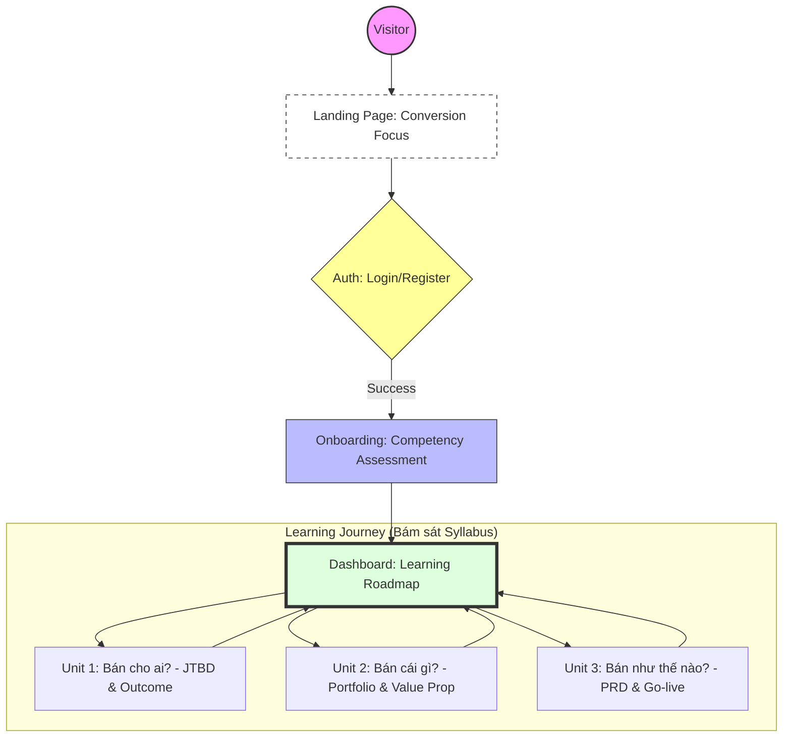

# A5. Sitemap & Navigation Flow

Tài liệu này định nghĩa cấu trúc phân cấp trang và luồng trải nghiệm người dùng (UX Flow) cho nền tảng **Web AI Builders**, tập trung vào việc chuyển đổi từ người truy cập (Visitor) thành học viên thực thi (Builder).

---

## 1. Visual Sitemap Overview

---

## 2. Chi tiết Cấu trúc Phân cấp (Page Hierarchy)

### [A] Khu vực Công cộng (Visitor Area)
*   **Landing Page (Trang chủ):**
    *   Mục tiêu: "Phá băng" và chuyển đổi.
    *   Nội dung: Vấn đề của Non-tech -> Giải pháp Web AI -> Kết quả thực tế.
    *   **CTA:** [Tham gia ngay] điều hướng tới trang Auth.

### [B] Khu vực Học viên (Member Portal)
*   **1. Giai đoạn Nhập môn (Onboarding):**
    *   **Competency Test:** Bài đánh giá 11 năng lực KSA (Dreyfus Model).
    *   **Student Portrait:** Hiển thị kết quả Radar Chart và lưu trữ trạng thái bắt đầu.
*   **2. Lộ trình Học tập (The Roadmap):**
    *   **Unit 1 (Bán cho ai):** Giải mã Jobs-to-be-done.
    *   **Unit 2 (Bán cái gì):** Thiết kế Product Portfolio.
    *   **Unit 3 (Bán như thế nào):** Viết PRD, Sitemap và triển khai trên Google Antigravity.

---

## 3. Luồng Trải nghiệm Người dùng (User Journey)

| Bước | Hành động | Trạng thái / Kết quả |
| :--- | :--- | :--- |
| **01** | Truy cập Landing Page | Hiểu giá trị khóa học & Click CTA. |
| **02** | Đăng ký / Đăng nhập | Xác thực danh tính học viên. |
| **03** | Làm Competency Test | Xác định "Điểm A" (Trình độ hiện tại). |
| **04** | Truy cập Roadmap | Mở khóa Unit 1 và bắt đầu học/làm. |
| **05** | Nộp Artifacts | Hệ thống lưu file vào My Studio. |

---

## 4. Ánh xạ Kỹ thuật (Technical Mapping)

-   `/` : Landing Page
-   `/auth` : Login / Register
-   `/onboarding` : Competency Assessment
-   `/dashboard` : Learning Roadmap Overview
-   `/unit/:id` : Detailed Learning Content & Task
-   `/studio` : Personal Workspace & Artifacts
