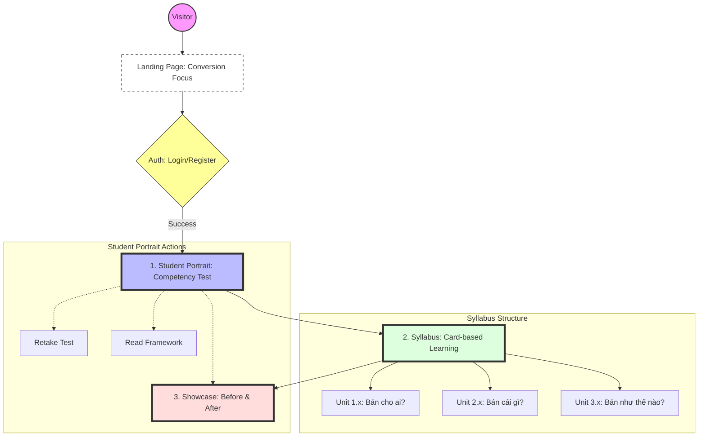

# A5. Sitemap & Navigation Flow

Tài liệu này định nghĩa cấu trúc phân cấp trang và luồng trải nghiệm người dùng (UX Flow) cho nền tảng **Web AI Builders**, tập trung vào việc chuyển đổi từ người truy cập (Visitor) thành học viên thực thi (Builder).

---

## 1. Visual Sitemap Overview

---

## 2. Hệ thống Điều hướng Chính (Main Navigation)

Nền tảng tập trung vào 3 mục chính (NavItems) nhằm tối ưu hóa hành trình từ "Học" đến "Làm":

### 1. Student Portrait (Chân dung Học viên)
*   **Mục đích:** Nơi định vị bản thân và lưu trữ quá trình trưởng thành.
*   **Tính năng chính:**
    *   **Competency Test:** Bài kiểm tra 11 năng lực KSA dựa trên [Competency Framework](file:///Users/danghong/Documents/WebAI%20Builders/Input/Competency_Framework.md).
    *   **Kết quả:** Hiển thị và lưu trữ biểu đồ năng lực (Radar Chart).
*   **Hành động sau bài test (Post-test Actions):**
    *   `[Làm lại bài test]`: Cho phép cập nhật trình độ mới.
    *   `[Upload Website đầu tiên]`: Điều hướng đến mục Showcase để bắt đầu hành trình biến đổi.
    *   `[Xem Khung năng lực]`: Mở toàn bộ tài liệu chi tiết về [Competency Framework](file:///Users/danghong/Documents/WebAI%20Builders/Input/Competency_Framework.md).

### 2. Syllabus (Lộ trình Học tập)
*   **Mục đích:** Truyền tải nội dung khóa học/sách theo cấu trúc phân cấp thông tin rõ ràng.
*   **Giao diện & Layout:**
    *   **Layout:** Kết hợp Card-based Layout (tổng quan Unit) và Course Outline Layout (chi tiết bài học).
    *   **Header:** Thông tin tổng quan gồm Ảnh cover + Tiêu đề chính + Mô tả ngắn.
    *   **Body (The List):** Vertical Stack sử dụng hệ thống đánh số (1.1, 1.2, 2.1...) để tạo **Visual Hierarchy** (Thứ bậc thị giác).
*   **Nội dung:** Chi tiết bám sát [Syllabus WebAI Builders](file:///Users/danghong/Documents/WebAI%20Builders/Input/Syllabus%20WebAI%20Builders.md).

### 3. Showcase (Triển lãm Sản phẩm)
*   **Mục đích:** Minh chứng cho kết quả thực thi.
*   **Tính năng chính:**
    *   **Transformation Display:** Giao diện so sánh trực quan **Before & After** (Trước và Sau khóa học).
    *   **Upload Portal:** Nơi học viên đăng tải link/hình ảnh website đầu tay của họ.

---

## 3. Luồng Trải nghiệm Người dùng (User Journey)

| Bước | Hành động | Trạng thái / Kết quả |
| :--- | :--- | :--- |
| **01** | Truy cập Landing Page | Hiểu giá trị khóa học & Click CTA. |
| **02** | Đăng ký / Đăng nhập | Xác thực danh tính học viên. |
| **03** | **Student Portrait** | Làm Competency Test -> Xác định "Điểm A". |
| **04** | **Syllabus** | Học theo lộ trình phân cấp (1.1, 1.2...). |
| **05** | **Showcase (Before)** | Upload thực trạng website/ý tưởng ban đầu. |
| **06** | **Showcase (After)** | Hoàn thiện & Go-live website mới sau thực chiến. |

---

## 4. Ánh xạ Kỹ thuật (Technical Mapping)

-   `/` : Landing Page
-   `/auth` : Login / Register
-   `/portrait` : **Student Portrait** (Assessment & Results)
-   `/syllabus` : **Syllabus** (Card-based & Course Outline)
-   `/showcase` : **Showcase** (Before & After Transformation)
-   `/framework` : Competency Framework Detailed Reference
